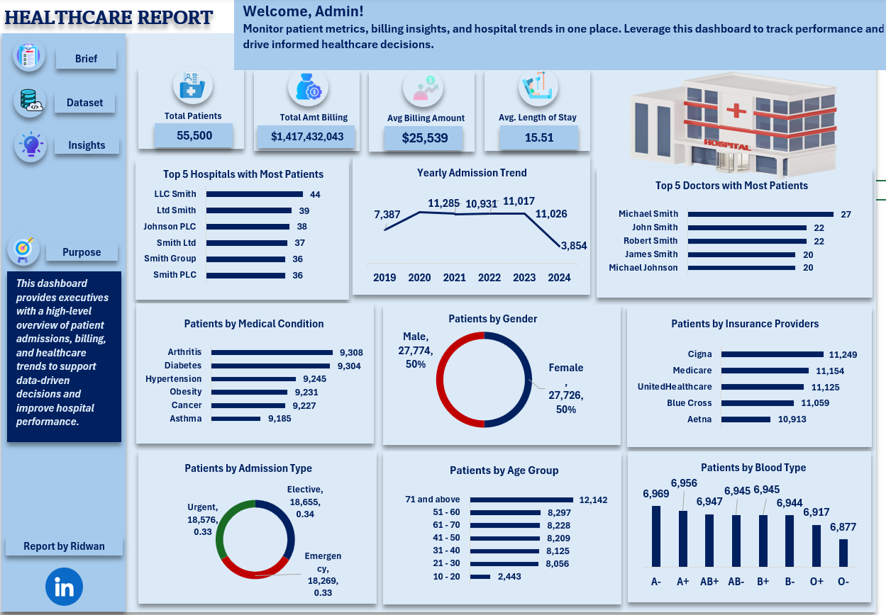

# 🏥 Healthcare Analytics Dashboard 

## 📌 Project Overview
This project is an **Excel-based Healthcare Analytics Dashboard** that provides a **high-level overview of patient admissions, billing insights, and hospital trends**.  
The dashboard is designed to help healthcare administrators and decision-makers monitor performance and support data-driven decisions.

---

## 🎯 Objectives
- Analyze patient admissions and hospital performance  
- Track billing trends and average costs  
- Understand patient demographics and medical conditions  
- Identify top hospitals, doctors, and insurance providers  

---

## 📊 Key Metrics (KPIs)
- **Total Patients:** 55,500  
- **Total Billing Amount:** $1.4B+  
- **Average Billing Amount:** $25,539  
- **Average Length of Stay:** 15.51 days  

---

## 🧹 Data Cleaning & Transformation
All data preparation was performed using **Power Query in Excel**, including:
- Removing duplicates and handling missing values  
- Standardizing column names and data formats  
- Creating calculated columns  
- Transforming raw data into analysis-ready tables  

---

## 📈 Data Analysis
Analysis was carried out using **Excel Pivot Tables**, enabling:
- Patient count analysis by hospital, doctor, and condition  
- Yearly admission trend analysis  
- Breakdown by admission type and insurance provider  
- Demographic analysis by gender, age group, and blood type  

---

## 📊 Data Visualization
Insights are visualized using **Excel Pivot Charts**:
- Bar charts for top hospitals, doctors, and conditions  
- Line chart for yearly admission trends  
- Donut charts for gender and admission type distribution  
- Clean, interactive dashboard layout for easy exploration  

---

## 📂 Dataset Description
The dataset includes:
- Patient demographics  
- Admission details and length of stay  
- Medical conditions  
- Hospital and doctor information  
- Billing amounts and insurance providers  

*(Dataset used for learning and analytical purposes.)*

---

## 💡 Key Insights
- Admissions peaked between **2020 and 2023**, followed by a decline in 2024  
- Emergency and elective admissions account for the majority of cases  
- A small group of hospitals and doctors manage a large share of patients  
- Insurance coverage is dominated by a few major providers  

---

## 📸 Dashboard Preview

---

## 🚀 Future Improvements
- Add slicers for deeper interactivity  
- Automate data refresh using Power Query  
- Expand analysis with additional healthcare metrics  
- Migrate the dashboard to Power BI for advanced analytics  

---

## 👤 Author
**Ridwan**  
Data Analyst | Excel (Power Query, Pivot Tables, Pivot Charts)

📌 *Feedback and suggestions are welcome!*

---

> *“Good analysis begins with clean data and ends with clear insight.”*
